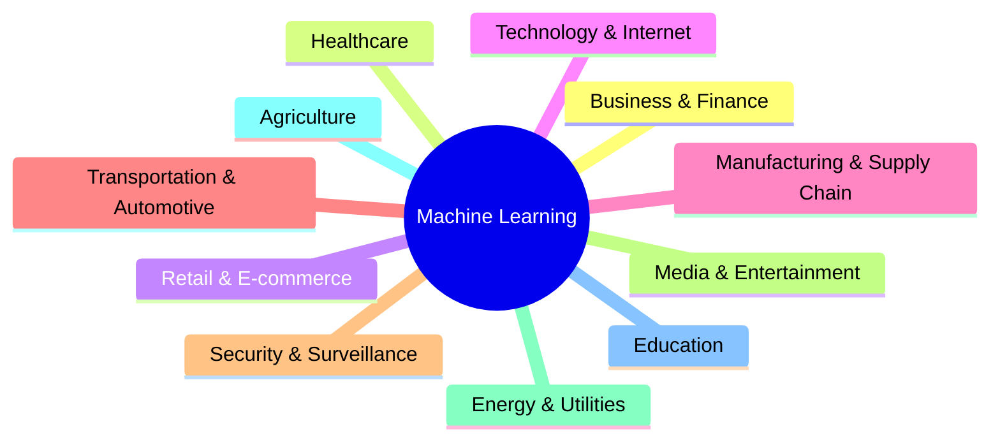

## Machine Learning

Introduction

---

### What is Machine Learning?

- **Learn** from data and **improve** without explicit programming.
- Process of solving problem by collecting data and algorithmically building statistical **model** from that data.
- Make system identify **pattern** and make **decisions**.

---

##### What are the use cases for Machine Learning?

---

### Why Machine Learning?

- Automate monotonous and repetitive tasks to avoid any human errors.
- Help to predict and make decisions based on the historic data.
- Improve accuracy and efficiency of the businesses strategies.

---

### Types of Machine Learning

---

### Workflow

