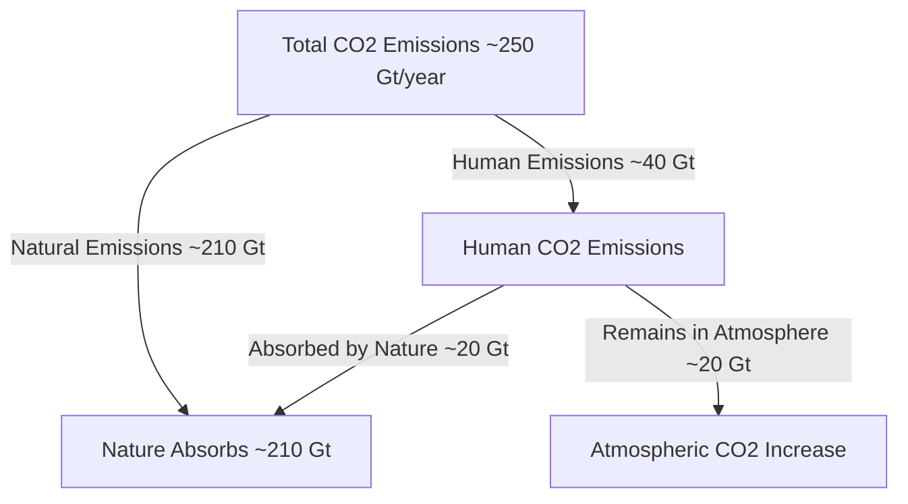
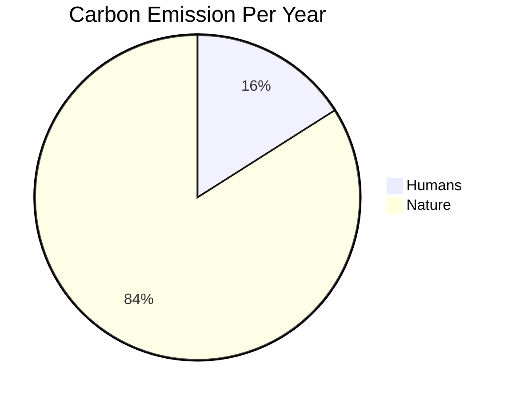
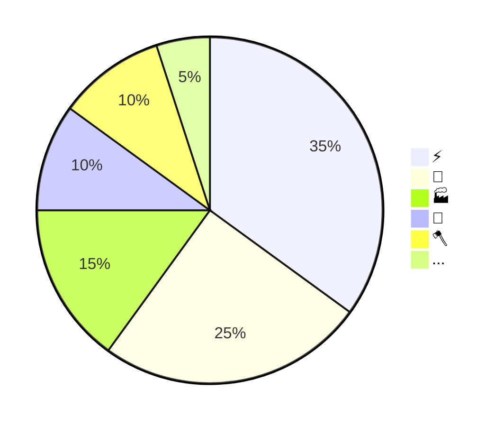

# Carbon Emission

---

## Definition

Carbon emission refers to the release of Carbon Dioxide (CO2) into the atmosphere due to **human** activities or natural processes.

---

## Absorption

---

## Distribution

---

## Nature

Nature produces the CO2 through,

- Respiration
- Decomposition
- Volcanos
- Wild Fire etc.

and absorbs through,

- Forest (~30%)
- Ocean (~30%)

---

## Humans

Humans produces the CO2 through,

- Industry
- Manufacturing
- Electricity
- Transportation
- Farming
- Deforestation
- Crop Residue Burning etc.

---

## Average

- 2010-2019, average annual increase was ~1.8%.
- 2020, pandemic led to ~5% decrease. 🍀
- 2021, rebounded with **~6%** increase. ❗️
- Recent average is around ~1.2%.

---

## Human CO2 Distribution

---

## CO2 By Sources

- Coal: ~1kg/kWh ‼️
- Natural Gas: ~0.5kg/kWh
- Oil: ~0.75kg/kWh
- Solar: ~40g/kWh
- Nuclear/ Wind/ Hydropower: < 15g/kWh

> With Coal; 1-ton air conditioner used for an hour generates ~1kg of CO2.

---

## Data Centers

---

### Aviation & Cloud

- Data Center: ~2 to 4%
- Commercial Flights: ~2 to 3%

> Data centers likely going to consume up to 10% of global electricity supply in the next decade.

---

## Solution

- Renewable Energy
- Policy Change
- Reforestation
- Energy Efficiency

---

### Corporate Climate Commitments

---
#

 <h1> Thank You!</h1>
