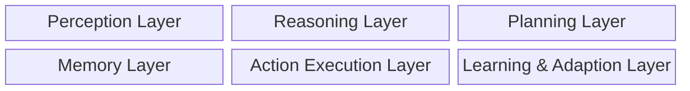
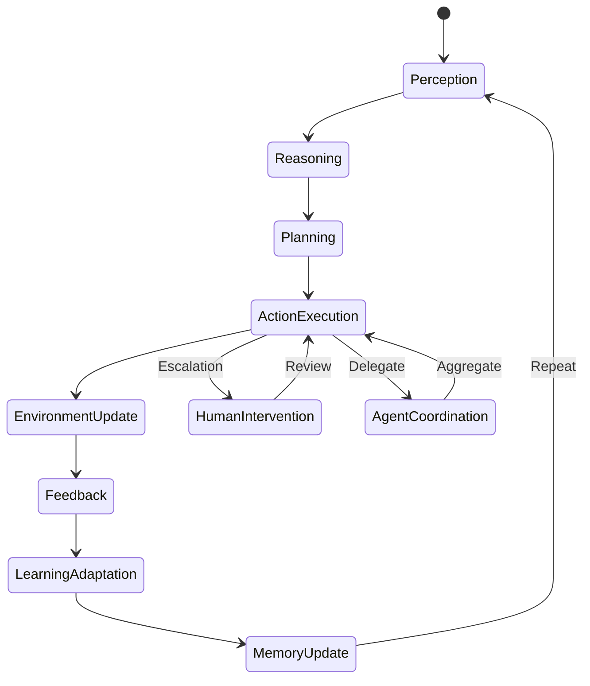

## Introduction

Artificial Intelligence (AI) focuses on building systems capable of performing tasks that requires human intelligence. Further categorised into Narrow AI (eg. chatbot, recommendation systems) and General AI (reasoning, logical and intellectual tasks - _theoritical_ [AGI](https://en.wikipedia.org/wiki/Artificial_general_intelligence)).

Generative AI introduced the ability to generate new content based on prompts and context, resembling human creativity. It opened vast possibilities for automatic generation of text, images, videos, audio, code, and more.

You no longer need to draft an entire email yourself—simply write a prompt like: "Draft an email for my 3-day leave next week, from Monday to Thursday." (The prompt doesn’t even need to be grammatically correct!)

Generative AI has already started disrupting many areas of human life. No business can remain untouched by this new technology, as it is transforming the way we work, think, solve problems, and even perceive the world.

Agentic AI comprises of autonomous decision makers (_agents_) capable of independent action and goal-oriented behavior.
Agentic AI concept is not new and has been around for decades. However, Agentic AI - _built on top of GenAI_; can not only create, but also decide and act which makes it even more powerful.

## Beginning

In early 2000s Machine Learning started to emerge and we witnessed the significant developement in reinforcement learnings which is a crucial component of modern Agentic AI. The 2010s was the time of deep learning revolution; decade ending with GPT-3 in 2020 giving the agents _conversational_ capabilities.

Agentic AI may seem new, but it has a long history of research and development — from rule-based expert systems in the 1980s to sophisticated autonomous agents in the early 2020s.

## Agent

Imagine an agent as a robot - able to understand, think and act on it's own - in a _digital_ form.

Unlike other conventional AI systems, Agentic AI is different in many terms especially autonomy, awareness, goal based decision making and adaptivity. Agents are at the core of this technology - an agent is a system which can understand the environment, indulge into reasoning, take decisions and act to achieve something with minimal human involvement.  

Agents are built of multiple layers which coordinates to enable intelligent behaviour.

We will take a high level look at each layer to understand more on how this agents operates.

### Perception Layer

The perception layer is responsible for collecting and interpreting data from the environment. Data can be acquired through sensors, APIs, databases, and other sources. Before interpretation, it undergoes preprocessing steps such as extraction, normalization, and tokenization.

Interpretation is then performed using models like computer vision, speech recognition, and natural language processing, which transform raw data into a structured and meaningful representation.

### Reasoning Layer

The reasoning layer forms the core intelligence of the agent. It leverages Large Language Models (LLMs) and other reasoning techniques to understand context and make inferences—drawing conclusions from evidence, prior knowledge, and observations.

This layer essentially mimics human thought: analyzing inputs, recalling memory, and arriving at logical conclusions.

### Planning Layer

The planning layer is responsible for designing executable actions that achieve a defined goal. It breaks down complex tasks into smaller subtasks, arranges them in order based on dependencies and constraints, and can also prepare alternative strategies (Plan B) to handle unexpected failures.

### Memory Layer

The memory layer provides context and continuity for decision-making. It keeps track of past events, records, and decisions, while gradually accumulating patterns, preferences, and workflows. Over time, this enables the agent to make more accurate and personalized decisions.

### Action Execution Layer

The action execution layer translates planned actions into real-world execution. For instance, it may trigger API calls, initiate workflows, or interact with external systems to carry out the decisions made in earlier layers.

### Learning & Adaptation Layer

This layer ensures continuous improvement by learning from the outcomes of past actions. Through techniques like reward-based learning, model retraining, fine-tuning, and pattern mining, the agent adapts to new situations and evolves over time.

## Multi-Agent

For complex goals multiple agents need to collaborate, in this setup  agents need to shares the context for effective collaboration. This set up can be centralised, decentralised or human-operated. 

- **Centralized**: An orchestrator - meta agent(s), they assigns the task and collect the progress to make sure the agents collectively achieve the original goal.
- **Decentralized**: Agents communicate peer to peer, share the data and distribute work as per the need.
- **Human Operated**: Human takes care of governance, review and decision making.

Following would be the end to end high level workflow in multi-agent AgenticAI setup,

There are multiple abstractions in each of these layers, each has different components and services to be explored in depth. 

## Technologies By Layer

For better visualisation it would be essential to look into different technologies that can be used in each layer. There are numerous tools and technologies for setting up the architecture, we will try to mention basic and essential ones to keep things simple.

It’s important to understand the purpose of each layer. At the same time, the tools mentioned are not the only options—there are a vast number of tools available for each layer, and in many cases, the same technology can be applied across multiple layers.

This provides a high-level view of the Agentic AI architecture. In practice, the architecture we visualize always begins with the requirements. For example, building an image processing system for a large-scale enterprise with specific expectations may lead us to choose certain tools and technologies for each respective layer.

## Summary

Agentic AI brings together multiple layers to create intelligent systems that can sense, think, and act autonomously. 
While we explored basic architecture and tools commonly used in each layer, the choice of implementation always depends on the problem at hand, the scale, and the requirements of the system being built.

Agentic AI is still evolving, but understanding its architecture provides a strong foundation for designing practical and future-ready intelligent systems.
