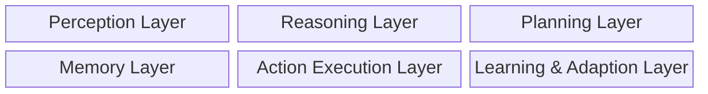

## Introduction

Artificial Intelligence (AI) focuses on building systems capable of performing tasks that requires human intelligence. Further categorised into Narrow AI (eg. chatbot, recommendation systems) and General AI (reasoning, logical and intellectual tasks - _theoritical_ [AGI](https://en.wikipedia.org/wiki/Artificial_general_intelligence)).

Generative AI introduced the ability to generate new content based on prompts and context, resembling human creativity. It opened vast possibilities for automatic generation of text, images, videos, audio, code, and more.

You no longer need to draft an entire email yourself—simply write a prompt like: "Draft an email for my 3-day leave next week, from Monday to Thursday." (The prompt doesn’t even need to be grammatically correct!)

Generative AI has already started disrupting many areas of human life. No business can remain untouched by this new technology, as it is transforming the way we work, think, solve problems, and even perceive the world.

Agentic AI comprises of autonomous decision makers (_agents_) capable of independent action and goal-oriented behavior.
Agentic AI concept is not new and has been around for decades. However, Agentic AI - _**built on top of GenAI**_; can not only create, but also decide and act which makes it even more powerful.

In this post we will going to dive deeper into the world of Agentic AI. 

## Beginning

In early 2000s Machine Learning started to emerge and we witnessed the significant developement in reinforcement learnings which is a crucial component of modern Agentic AI. The 2010s was the time of deep learning revolution; decade ending with GPT-3 in 2020 giving the agents _conversational_ capabilities. So far, the current decade has seen significant developement in Agentic AI. These dots may seem not connected yet but we will connect them soon.

Agentic AI may seem new, but it has a long history of research and development — from rule-based expert systems in the 1980s to sophisticated autonomous agents in the early 2020s.

## Agent

Imagine an agent as a robot - able to understand, think and act on it's own - in a _digital_ form.

Unlike other conventional AI systems, Agentic AI is different in many terms especially autonomy, awareness, goal based decision making and adaptivity. Agents are at the core of this technology - an agent is a system which can understand the environment, indulge into reasoning, take decisions and act to achieve something with minimal human involvement.  

Agents are built of multiple layers which coordinates to enable intelligent behaviour.

We will dive into each layer to understand more on how this agents operates.
