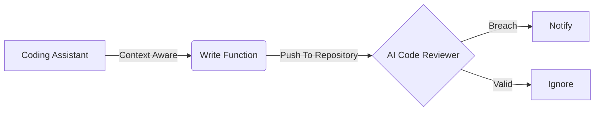

## Clean Code

Clean Code, in simple terms, is code that is easy to read, understand, and maintain. The concept was popularized by Robert C. Martin in his [book](https://amzn.in/d/255Gkj5) "Clean Code: A Handbook of Agile Software Craftsmanship (Robert C. Martin Series)". You can also read a quick summary [here](https://gist.github.com/wojteklu/73c6914cc446146b8b533c0988cf8d29).

In a nutshell, Clean Code is a practice that helps teams in the long run. However, in real-world scenarios, developers may need to trade off between following the practice strictly and meeting business needs. Whether you write code yourself or with the help of an AI assistant, Clean Code is essential for any application, irrespective of its domain or scale.

Clean code practice brings several benefits,

- Reduces overall time to understand the code
- Enables new members to ramp up quickly
- Ensures the consistency across the codebase
- Effective collaboration
- Helps teams to modify and maintain code effectively
- Improves testability & traceability

Apparently, business needs and stricter deadlines, teams may compromise with Clean Code. However, the habit of coming back to this practice again and again is essential for a team.

## GenAI - Coding Assistants

In the era of GenAI, coding assistants have emerged rapidly in the last few years - disrupting the conventional way of writing code. Software developers have started relying more and more on these tools for writing code faster and that too with best possible approach - placing more responsibility on developers to ensure that the generated code meets expectations, especially given the volatility of the GenAI field and the [claim](https://youtu.be/7k1ehaE0bdU?t=7691) of replacing engineers (_humans_).

Things are changing and continue to change in different directions. However, one thing is clear that we will have one strong companion who can help us with great speed and flexibility - depending on the instructions (_prompts_) we extend in the first place. The game has shifted from being consistently _writing_ effective code to effectively _guiding_ to write consistent code. To be honest, the former was more fun, but the new approach is not necessarily a party pooper — even if it sometimes feels that way.

There are several advantages we can definitely observe with this way of writing code - subject to context and prompts. Listing few of them for reference,

- Super fast in solving complex coding problems
- Rapid onboarding of new team members
- Automation of monotonous tasks
- Early detection of bugs in code
- Driven by data instead of intuition
- Real time code suggestions and optimizations
- Equal Support for modern and legacy systems

## Coding Assistant and Clean Code

Currently, the majority of software developers are using coding assistants — but whether they are using them effectively is a better question. Coding assistants are navigators, not drivers. Developers should always remain in the driver’s seat and think of assistant as someone sitting next to you helping to drive _properly_ and moving into the right _direction_. 

Remember, the navigator may distract or show wrong direction. (_imagine your parent/spouse_ 😅).


Coding assistant is growing much faster than expected because of the backed models and industry shift. Organisations are competing for _faster_ growth along with better quality. There are numerous coding assistants which are shaping (_changing_) the way we developers code.

Here are a few popular tools:

- [Copilot](https://github.com/features/copilot)
- ~~Codeium~~ [Windsurf](https://windsurf.com/)
- [Cursor](https://cursor.com/)
- [kiro](https://kiro.dev/)
- [Tabnine](https://www.tabnine.com/)

Some are assistants, while others provide a complete IDE equipped with AI features to enable strong control and enhanced capabilities. These tools are instructed by prompt while backed by data and context.

Bringing back the attention to the Clean Code; simple question could be  "_Can't all AI assistant be configured to write Clean Code?_".

- If the answer is **Yes** - "_Do we still need to worry much about Clean Code?_"
- If the answer is **No** - "_How can we ensure the assistant suggest Clean Code?_"

The answer is between Yes and No and the reason is 'Training Data Bias'.

AI models are trained on code from public repositories, blogs, and forums. As a result, the generated code can be either clean or messy. While you may often get reasonably clean code, you cannot blindly trust it. The primary focus is correctness and speed; not maintainability, readability, testability etc.

This makes it even more important to understand and practice Clean Code yourself. At the same time, modifying your prompts to explicitly request clean practices can be a helpful habit — especially when dealing with complex logic.

Let's compare two prompts,

> "Write Java code to calculate factorial of a number."

```java
public class Factorial {
    public static int fact(int n) {
        if(n == 0) return 1;
        else return n * fact(n-1);
    }
    public static void main(String[] args) {
        int n = 5;
        System.out.println(fact(n));
    }
}
```

> "Write clean, maintainable Java code to calculate factorial of a number. Use meaningful names, follow single responsibility principle, add input validation, comments, and handle edge cases."

```java
public class FactorialCalculator {

    /**
     * Calculates the factorial of a non-negative integer.
     *
     * @param number non-negative integer
     * @return factorial of the number
     * @throws IllegalArgumentException if number is negative
     */
    public static long calculateFactorial(int number) {
        if (number < 0) {
            throw new IllegalArgumentException("Factorial is not defined for negative numbers.");
        }

        long result = 1;
        for (int i = 1; i <= number; i++) {
            result *= i;
        }
        return result;
    }

    public static void main(String[] args) {
        int input = 5;
        long factorial = calculateFactorial(input);
        System.out.println("Factorial of " + input + " is: " + factorial);
    }
}
```

We can clearly see the difference in generated code. 

> "Write clean, maintainable, **testable** Java code to calculate factorial of a number. Use meaningful names, follow single responsibility principle, add input validation, comments, and handle edge cases."

```java
/**
 * FactorialCalculator provides a method to calculate the factorial of a number.
 */
public class FactorialCalculator {

    /**
     * Calculates the factorial of a non-negative integer.
     *
     * @param number non-negative integer
     * @return factorial of the number
     * @throws IllegalArgumentException if number is negative
     */
    public long calculateFactorial(int number) {
        if (number < 0) {
            throw new IllegalArgumentException("Factorial is not defined for negative numbers.");
        }

        long result = 1;
        for (int i = 2; i <= number; i++) {
            result *= i;
        }
        return result;
    }
}
```

Adding testability factor makes it switch to _non-static_ method.

But you don't need to write it again and again. You can introduce clean code practice into the context itself and forget. Everytime it tries to answer based on the context you will always receive clean code induced response.

That means we are the first reviewers of the code generated by AI. Well again, the AI can be used to review code generated by AI and let us know if another review is required putting us in a reactive role.



## Conclusion

Clean Code practices are still highly relevant, and we must keep a close eye on AI-generated code. The coding assistants and IDE are helpers but can surely make mistakes. Instead of relying blindly on responses, proactively guide them to align with Clean Code practices and keep yourself accountable to ensure the code that you are asking to generate or using in your code base needs to be aligned with Clean Code practices.
