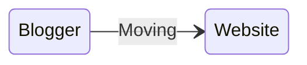

I’ve decided to start writing my blog posts here as well. The existing [blog](https://www.blog.akashthakare.com/) will continue to remain there.

### _But Why?_

In my opinion this setup will give me better control and flexibility to do more compared to Google Blogger. I had explored it enough and it has been an insightful learning experience in understanding and tweaking it for my needs.

I just wanted to simplify and optimize my setup by bringing everything under one umbrella.

I’ve been experimenting with several new ideas and will continue exploring in the future. Along the way, I’ll refine and improve this setup gradually. This will be a journey of trying out different possibilities and finding what works best for my workflow.

Thus here is the ~~First~~ Blog Post!

Thank you.
